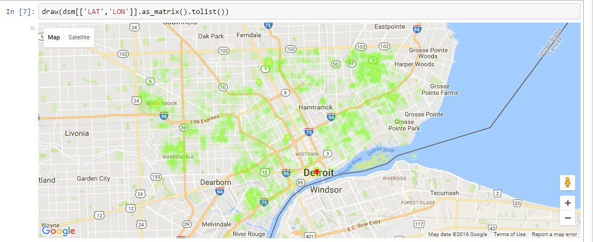
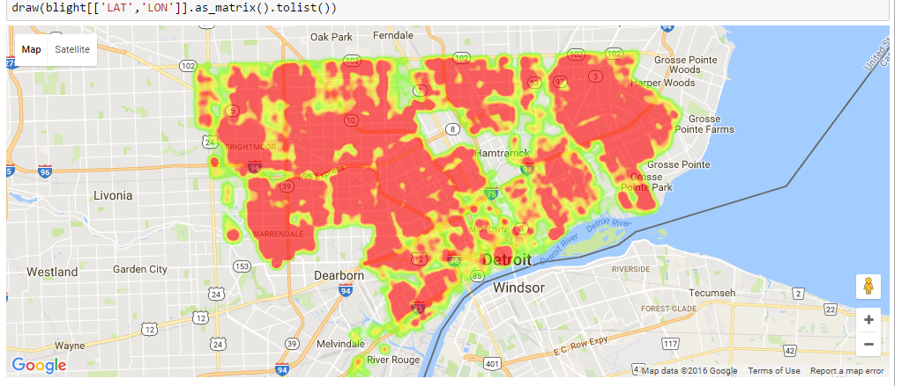
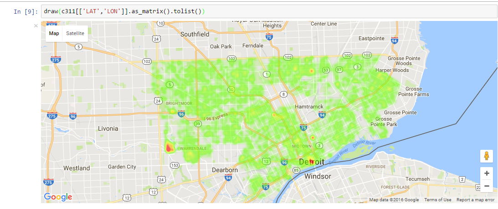
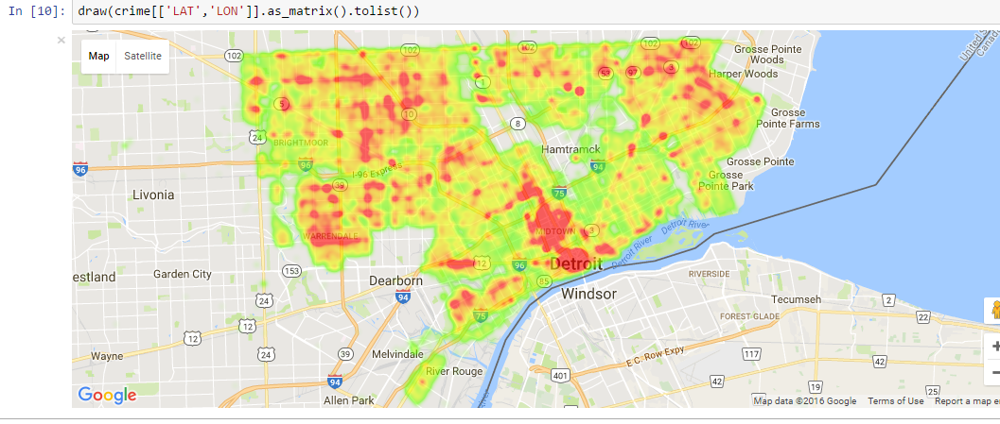

# Final report
#### [*Duc Thien Bui*](https://github.com/ducthienbui97)

## Task
Work with real data collected in Detroit to help urban planners predict blight. Data files used in this project can be download from [Instructor's github](https://github.com/uwescience/datasci_course_materials/tree/master/capstone/blight).

* detroit-blight-violations.csv : Each record is a blight violation incident.
* detroit-demolition-permits.tsv: Each record represents a permit for a demolition.
* detroit-311.csv: Each record represents a 311 call, typically a complaint
* detroit-crime.csv: Each record represents a criminial incident.

## Preprocess:
(PreProcess.ipynb)

First of all, for each activity in these files happened in specific place, some data is provided with latitude and longitude in some way, however many activities only have the address of where it happened. Therefore, before start working with these data, I added features representing latitude and longitude of actitivities:

* With data detroit-blight-violations: I got the location from ViolationAddress feature.
* With data detroit-demolition-permits: I got almost all location from site_location feature, however, some item does not contain any coordinates information, but I can't drop them because this file is critical to label data so instead, I used geopy libraries to transform address to coordinates info using Bing's api (Google api's quota is to low).
* With data detroit-311: There were already features indicate latitude and longitude so I did not have to do anything.
* With data detroi-crime: There were also features indicate latitude and longitude info and I droped some data as I can not find their coordinate info.

## Visualization:
(Visualization.ipynb)
##### Detroit demolition permits:

#### Detroit blight violations:

#### Detroit 311:

#### Detroit crime:


## Building define (Clustering):
(Clustering.ipynb)

First, I get all coordiates data of all actitities from all data files:
```python
points_demolition = get_lat_lon(detroit_demolition_permits)
points_blight = get_lat_lon(detroit_blight_violations)
points_crime = get_lat_lon(detroit_crime)
points_311 = get_lat_lon(detroit_311)
```
```python
points_demolition.shape
```
    (7133L, 2L)
```python
points_blight.shape
```
    (307804L, 2L)
```python
points_crime.shape
```
    (119901L, 2L)
```python
points_311.shape
```
    (19680L, 2L)
```python
coords = np.concatenate((points_demolition ,points_blight,points_crime,points_311))
```

Then, I use DBSCAN with haversine as formula to caculate distance. I defined that if 2 actitities happened within 30m, they are in a same 'building'
```python
kms_per_radian = 6371.0088
epsilon = 0.03 / kms_per_radian
db = DBSCAN(eps=epsilon, min_samples=1, algorithm='ball_tree', metric='haversine',n_jobs=-1).fit(np.radians(coords))
```
```python
cluster_labels = db.labels_
num_clusters = len(set(cluster_labels))
num_blighted = len(set(cluster_labels[:7133]))
print('Number of building: {}'.format(num_clusters))
print('Number of blighted building: {}'.format(num_blighted))
```
    Number of building: 40821
    Number of blighted building: 3739

## Transforming data:
(Data_creating.ipynb)

Based on original data and the data I prepaired, I created a new data file that will be used to run machine learning algorithm on.
#### From detroit-311 data:
I got 2 feature: the average rating of 311 call from a place and number of call from that place. Places without 311 I set these features as 0

#### From detroit-blight-violations:
Total AdminFee,CleanUpCost,FineAmt,JudgmentAmt,LateFee from a place along with total number of all Violation category 0,1, and number of Violation with code starting with 9,22 and 61 
```python
detroit_blight_violations = detroit_blight_violations[['label','AdminFee','CleanUpCost','FineAmt','JudgmentAmt',
'LateFee','Cate0','Cate1','Code9','Code22','Code61']]
```
```python
detroit_blight_violations = detroit_blight_violations.groupby('label',as_index = False).sum()
```

#### From detroit-crime: 
There was a list of crime with differents category and I realized that not all of them related to the place where its happened so I only select some of them and set as "crimes". Then with a place, I count total number of "crimes" activites happend.
```python
detroit_crime[u'CATEGORY'].value_counts().index
```
    Index([u'TRAFFIC VIOLATIONS-MOTORCYCLE VIOLATIONS', u'ASSAULT', u'LARCENY',
           u'DAMAGE TO PROPERTY', u'AGGRAVATED ASSAULT', u'BURGLARY',
           u'STOLEN VEHICLE', u'TRAFFIC VIOLATIONS-DRIVING ON SUSPENDED', u'FRAUD',
           u'ROBBERY', u'DANGEROUS DRUGS', u'OBSTRUCTING JUDICIARY',
           u'WEAPONS OFFENSES', u'ESCAPE', u'SOLICITATION', u'BRIBERY', u'ARSON',
           u'OUIL DISPOSE OF VEHICLE TO AVOID FORFEITURE', u'RUNAWAY',
           u'STOLEN PROPERTY', u'OBSTRUCTING THE POLICE', u'FAMILY OFFENSE',
           u'HOMICIDE', u'OTHER BURGLARY', u'HEALTH-SAFETY', u'KIDNAPING',
           u'FORGERY', u'EXTORTION', u'PUBLIC PEACE', u'ENVIRONMENT',
           u'VAGRANCY (OTHER)', u'LIQUOR', u'CONSPIRACY BY COMPUTER',
           u'EMBEZZLEMENT', u'OUIL', u'REVOKED', u'ANTITRUST', u'TAX REVENUE',
           u'IMMIGRATION', u'NEGLIGENT HOMICIDE', u'OBSCENITY', u'ELECTION LAWS',
           u'JUSTIFIABLE HOMICIDE', u'GAMBLING', u'DRUNKENNESS', u'CONGRESS',
           u'FELONY DEATH FROM FLEEING VEHICLE', u'SOVEREIGNTY', u'MILITARY',
           u'MISCELLANEOUS ARREST'],
          dtype='object')
```python
crimes = [u'ASSAULT', u'LARCENY',u'DAMAGE TO PROPERTY', u'AGGRAVATED ASSAULT', u'BURGLARY',u'STOLEN VEHICLE', u'FRAUD',
          u'ROBBERY', u'DANGEROUS DRUGS',u'WEAPONS OFFENSES', u'ARSON', u'STOLEN PROPERTY', u'HOMICIDE', u'OTHER BURGLARY', 
          u'HEALTH-SAFETY', u'KIDNAPING',u'FORGERY', u'EXTORTION', u'PUBLIC PEACE',u'VAGRANCY (OTHER)', u'SOVEREIGNTY']
```


```python
crimes = set(crimes)
```

```python
detroit_crime['crime'] = detroit_crime.CATEGORY.apply(lambda x: x in crimes).apply(int)
```

```python
detroit_crime = detroit_crime[['label','crime']].groupby('label',as_index=False).sum()
```
#### From detroit-demolition-permits:
All place that appeared in this data are marked blighted.

#### Final data:


<div>
<table border="1" class="dataframe">
  <thead>
    <tr style="text-align: right;">
      <th></th>
      <th>blighted</th>
      <th>311 count</th>
      <th>rating</th>
      <th>AdminFee</th>
      <th>CleanUpCost</th>
      <th>FineAmt</th>
      <th>JudgmentAmt</th>
      <th>LateFee</th>
      <th>Cate0</th>
      <th>Cate1</th>
      <th>Code9</th>
      <th>Code22</th>
      <th>Code61</th>
      <th>crime</th>
    </tr>
  </thead>
  <tbody>
    <tr>
      <th>0</th>
      <td>True</td>
      <td>0</td>
      <td>0.000000</td>
      <td>160.0</td>
      <td>0.0</td>
      <td>1800.0</td>
      <td>2220.0</td>
      <td>180.0</td>
      <td>8.0</td>
      <td>0.0</td>
      <td>4.0</td>
      <td>3.0</td>
      <td>1.0</td>
      <td>0.0</td>
    </tr>
    <tr>
      <th>1</th>
      <td>True</td>
      <td>0</td>
      <td>0.000000</td>
      <td>1100.0</td>
      <td>0.0</td>
      <td>11500.0</td>
      <td>14030.0</td>
      <td>1150.0</td>
      <td>55.0</td>
      <td>0.0</td>
      <td>39.0</td>
      <td>16.0</td>
      <td>0.0</td>
      <td>8.0</td>
    </tr>
    <tr>
      <th>2</th>
      <td>True</td>
      <td>0</td>
      <td>0.000000</td>
      <td>420.0</td>
      <td>0.0</td>
      <td>4400.0</td>
      <td>5470.0</td>
      <td>440.0</td>
      <td>21.0</td>
      <td>0.0</td>
      <td>16.0</td>
      <td>4.0</td>
      <td>1.0</td>
      <td>0.0</td>
    </tr>
    <tr>
      <th>3</th>
      <td>True</td>
      <td>1</td>
      <td>2.000000</td>
      <td>520.0</td>
      <td>0.0</td>
      <td>6900.0</td>
      <td>8370.0</td>
      <td>690.0</td>
      <td>26.0</td>
      <td>0.0</td>
      <td>23.0</td>
      <td>3.0</td>
      <td>0.0</td>
      <td>3.0</td>
    </tr>
    <tr>
      <th>4</th>
      <td>True</td>
      <td>9</td>
      <td>3.444444</td>
      <td>940.0</td>
      <td>0.0</td>
      <td>18400.0</td>
      <td>21620.0</td>
      <td>1840.0</td>
      <td>45.0</td>
      <td>2.0</td>
      <td>38.0</td>
      <td>8.0</td>
      <td>1.0</td>
      <td>7.0</td>
    </tr>
    <tr>
      <th>5</th>
      <td>True</td>
      <td>0</td>
      <td>0.000000</td>
      <td>180.0</td>
      <td>0.0</td>
      <td>2900.0</td>
      <td>3460.0</td>
      <td>290.0</td>
      <td>9.0</td>
      <td>0.0</td>
      <td>6.0</td>
      <td>3.0</td>
      <td>0.0</td>
      <td>0.0</td>
    </tr>  
    <tr>
      <th>...</th>
      <td>...</td>
      <td>...</td>
      <td>...</td>
      <td>...</td>
      <td>...</td>
      <td>...</td>
      <td>...</td>
      <td>...</td>
      <td>...</td>
      <td>...</td>
      <td>...</td>
      <td>...</td>
      <td>...</td>
      <td>...</td>
    </tr>
    <tr>
      <th>40817</th>
      <td>False</td>
      <td>1</td>
      <td>2.000000</td>
      <td>0.0</td>
      <td>0.0</td>
      <td>0.0</td>
      <td>0.0</td>
      <td>0.0</td>
      <td>0.0</td>
      <td>0.0</td>
      <td>0.0</td>
      <td>0.0</td>
      <td>0.0</td>
      <td>0.0</td>
    </tr>
    <tr>
      <th>40818</th>
      <td>False</td>
      <td>1</td>
      <td>2.000000</td>
      <td>0.0</td>
      <td>0.0</td>
      <td>0.0</td>
      <td>0.0</td>
      <td>0.0</td>
      <td>0.0</td>
      <td>0.0</td>
      <td>0.0</td>
      <td>0.0</td>
      <td>0.0</td>
      <td>0.0</td>
    </tr>
    <tr>
      <th>40819</th>
      <td>False</td>
      <td>1</td>
      <td>2.000000</td>
      <td>0.0</td>
      <td>0.0</td>
      <td>0.0</td>
      <td>0.0</td>
      <td>0.0</td>
      <td>0.0</td>
      <td>0.0</td>
      <td>0.0</td>
      <td>0.0</td>
      <td>0.0</td>
      <td>0.0</td>
    </tr>
    <tr>
      <th>40820</th>
      <td>False</td>
      <td>1</td>
      <td>2.000000</td>
      <td>0.0</td>
      <td>0.0</td>
      <td>0.0</td>
      <td>0.0</td>
      <td>0.0</td>
      <td>0.0</td>
      <td>0.0</td>
      <td>0.0</td>
      <td>0.0</td>
      <td>0.0</td>
      <td>0.0</td>
    </tr>
  </tbody>
</table>
<p>40820 rows × 14 columns</p>
</div>


## Classification:
(Classification.ipynb)

First, I split the data into training and testing data
```python
train, test = train_test_split(data, test_size = 0.2, random_state  = 317)
```

```python
train = train.reset_index(drop=True)
test = test.reset_index(drop=True)
```
But the training data is so unbalance as number of blighted is much smaller than not blighted places. So I only use a part of non blighted to set equal number of blighted and non blighted data


```python
blighted_train = train[train.blighted==True].reset_index(drop = True)
```
```python
unblighted_train = train[train.blighted!=True].reset_index(drop = True)
```
```python
blighted_train.shape
```
    (2978, 14)

```python
unblighted_train.shape
```
    (29678, 14)

```python
train_data = pd.concat([resample(unblighted_train,replace=False
                                 ,n_samples = blighted_train.shape[0]),blighted_train]).reset_index(drop=True)
train_data.shape
```
    (5956, 14)

I tested 7 Classifier algorithm: Logistic Regression,Multi-layer Perceptron, Random Forest, Adaptive Boosting, K nearest neighbors, quadratic discriminant analysis and nearest centroid. Out of them, quadratic discriminant analysis and nearest centroid have best result with accuracy of 89% and 88%
```python
label = train_data.blighted
train_data = train_data.drop('blighted',1)
train_data = train_data.reset_index(drop= True)
```

```python
model_lr = LogisticRegression(n_jobs=-1,random_state=317).fit(train_data,label)
model_NN = MLPClassifier(hidden_layer_sizes=(1000,),random_state=317).fit(train_data,label)
model_RF = RandomForestClassifier(n_estimators =30,n_jobs=-1,random_state=317).fit(train_data,label)
model_ada = AdaBoostClassifier(random_state=317).fit(train_data,label)
model_Knb = KNeighborsClassifier(n_jobs=-1,n_neighbors=6,leaf_size=3).fit(train_data,label)
model_QD = QuadraticDiscriminantAnalysis().fit(train_data,label)
model_nc = NearestCentroid().fit(train_data,label)
```
```python
model_lr.score(test_data,test_label)
```
    0.65886820186183248
```python
model_NN.score(test_data,test_label)
```
    0.50257226849583536
```python
model_RF.score(test_data,test_label)
```
    0.66364527192552669
```python
model_ada.score(test_data,test_label)
```
    0.77841744243018129
```python
model_Knb.score(test_data,test_label)
```
    0.77596766291033803
```python
model_QD.score(test_data,test_label)
```
    0.89674179323860848
```python
confusion_matrix(y_pred=model_QD.predict(test_data),y_true=test_label)
```
    array([[7138,  265],
           [ 578,  183]])
```python
model_nc.score(test_data,test_label)
```
    0.88620774130328273
```python
confusion_matrix(y_pred=model_nc.predict(test_data),y_true=test_label)
```
    array([[6970,  433],
           [ 496,  265]])


## Final thoughts

I think I made mistakes in all steps. My data need more features as some of my data have a values as zero. I also think I need some how use address to mark 'building' instead of coordiates. My original thoughts was to use map api to get more correct version of the address however because of api quora limits, I ended up using DBscan and coordinates. Furthermore, I thing my neural network have been overfitted as it's accuracy is roundly 50%.

